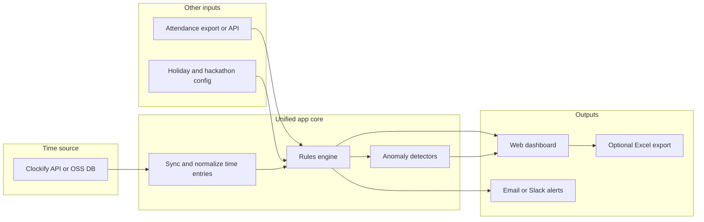

# Clockify timesheet automation (web dashboard primary)

## Your choice: output target

You selected **option C — web app or internal tool**, with **Excel export optional**. The plan below assumes reviewers work mainly in a browser; monthly [`Book.xlsx`](Book.xlsx)-style grids can be generated for archival or stakeholders who still want spreadsheets.

## “One system” vision (what you asked for)

Goal: **one internal product** employees and managers use for the whole loop—**time data + your compliance rules + attendance context + review grid + exports/alerts**—instead of juggling Clockify, Excel, and a separate script.

There are **two viable ways** to get there; pick based on appetite for migration vs speed:

| Approach | What “one system” means | Effort / risk |
|----------|-------------------------|---------------|
| **A — Clockify-anchored unified app (recommended default)** | **Single URL** for compliance dashboard, rules, Book-style month view, attendance merge, alerts, optional Excel. **Clockify stays** the system of record for projects/tags and (usually) where people log time; your app uses the **Clockify API** and can deep-link into Clockify to edit entries. | **Lower risk, faster**: no user migration, no retraining on a new timer UI unless you want it later. |
| **B — OSS time tracker + custom modules** | **Self-hosted OSS** (e.g. Kimai) becomes the time-tracking core; you **add** compliance, attendance joins, and Book-style reporting **on top** or **fork** and integrate. **Clockify eventually optional** after data migration. | **Higher effort**: migration, mapping projects/users, mobile expectations, and ongoing OSS upgrades—but **full control** and no SaaS lock-in. |

**Pragmatic path:** ship **A** first (one app, Clockify under the hood). Revisit **B** only if you explicitly need to leave Clockify.

### Clockify free plan: API, exports, and your phased “then we drop Clockify” roadmap

Per Clockify’s help center, **[API documentation is available on all subscription plans](https://clockify.me/help/troubleshooting/general-api-troubleshooting/is-access-to-api-documentation-available-on-all-subscription-plans)**. On **free** workspaces you can use the API, but you may be **unable to drive paid-only capabilities** through the API (e.g. some admin or subscription-gated features). For your use case—**reading time entries, users, projects, and running compliance**—the API is often sufficient; **confirm with a real API key** (smoke test `GET` time entries for a date range) before betting the architecture on it.

**If any endpoint or workflow is blocked or awkward on free:**

- Use **Reports → export** (e.g. **Detailed** / **Summary** to **CSV or Excel**) on a schedule; your tool implements an **import pipeline** that maps columns to the same **normalized time-entry model** the API sync would use. Treat exports as **bootstrap + safety net**, not only as a permanent crutch.

**Phased migration (matches your intent: import first, full replacement later):**

| Phase | Clockify role | Your tool |
|-------|----------------|-----------|
| **0 — Bootstrap** | Source of truth; weekly or daily **export** (or API if verified) | **Import** + store normalized entries; compliance grid + rules + attendance merge |
| **1 — Steady state** | Still where people log time | **API sync** (preferred) or automated export fetch; dashboards and alerts |
| **2 — Parity** | Optional | **Native timer / timesheet UI** in your app for the subset of features you audited as must-haves |
| **3 — Cutover** | **Stopped** | Single system; optional one-time **historical import** from final Clockify export for audit trail |

**Risk reducer:** Keep **idempotent imports** (dedupe by Clockify entry id if present in export, or by stable hash of user + start + end + description) so mixing API + file imports does not double-count.

### Open-source starting points (to save time if you choose B)

Use these as **bases to extend**, not as drop-in Clockify clones—expect gap analysis vs your audited feature list.

- **[Kimai](https://www.kimai.org/)** — Mature self-hosted time tracking: projects, customers, users, reporting, invoicing hooks; PHP/Symfony. Strong if you want “consulting-style” parity.
- **[SolidTime](https://github.com/solidtime-io/solidtime)** — Modern OSS stack (Laravel + Vue); good fit if you want a cleaner codebase to extend (verify current license and feature set against your audit).
- **[Traggo](https://traggo.net/)** — Lighter, tag-oriented; less enterprise surface area.
- **Heavier alternatives:** ERPNext / Odoo timesheet modules if you already run those stacks.

**Cherry-picking:** After the Clockify audit (below), tag each OSS candidate with **covers / partial / missing** so you do not over-buy scope.

### Clockify feature audit (browser session — cherry-pick what you need)

You suggested: open Clockify, authenticate, then do a **full analysis** and cherry-pick features. That is the right sequencing.

**Process (1–2 hour workshop, ideally after you approve moving past plan-only mode):**

1. **You** sign in to Clockify in the browser (workspace you use in production).
2. **Walk each area** and mark **Must / Should / Won’t** for your org:

   - **Time entry:** timer vs manual, duration vs start/end, breaks, drafts, “continue last entry”
   - **Structure:** workspaces, clients, projects, tasks, tags, billable flags, custom fields (if any)
   - **Views:** timesheet grid, calendar, dashboard summaries
   - **People:** teams, groups, roles, who can see whose time
   - **Policy (paid tiers):** approvals, required fields, locking past weeks—note what you pay for today
   - **Reports:** summary/detailed, rounding, export formats you rely on
   - **Integrations:** anything business-critical (Jira, Slack, calendar, API scripts)
   - **Mobile / desktop:** required or nice-to-have

3. **Deliverable:** a **feature matrix** (spreadsheet) mapping: *Clockify feature → owner system (Clockify vs your app vs OSS) → build phase*.

4. **Outcome:** Defines whether **A** is enough (most teams: yes) or **B** is justified.

**Note:** An automated browser pass can list UI structure, but **only you** can confirm which features are contractually or operationally required. API documentation complements the UI pass for anything headless.

## What you are automating (from the doc + sample files)

| Source | Role |
|--------|------|
| [Clockify_Automation_Rulesets_and_Future_Implementation.docx](Clockify_Automation_Rulesets_and_Future_Implementation.docx) | Policy: daily hour thresholds, anomaly rules, Jira ideas, reporting wishes |
| [Attendance.xlsx](Attendance.xlsx) | Per-employee, per-day codes (P, WO, EL, WFH, Hackathon context, etc.) — **leave / non-work-day truth** |
| [Book.xlsx](Book.xlsx) | Per-employee, per-day **review status** (Approved, Not Filled, Half Filled, Leave, Hackathon, W/O, Holiday, …) plus reviewer name |

**Policy gaps to resolve in config (not AI):** The doc says ≥8h → Approved, &lt;6h → Half Filled, no time → Not Filled. The **6–8 hour band** is undefined — define explicitly (e.g. “Half Filled” or “Needs review”) before coding thresholds.

## Recommended architecture (best fit)

Use a **hybrid** approach: **rules + APIs first**, **AI only where judgment or text patterns matter**.

- **Deterministic rules (primary):** Sum hours per user per calendar day; classify working vs non-working days using attendance codes + company calendar; apply Approved / Half Filled / Not Filled; override with Leave, Hackathon, W/O, Holiday when attendance (or config) says so.
- **Deterministic anomaly checks:** Total daily hours &gt; 12–14h; overlapping intervals same day; repeated identical blocks across days; weekend work unless allowlisted.
- **“Project misallocation”:** Start with **structured rules** (allowed project/client/task tags per role or team). Use **LLM only** if you must interpret free-text descriptions — higher cost and need for auditability.
- **AI agent:** Best as **optional** layer: natural-language explanations for flags, triage queue suggestions, or classifying ambiguous descriptions — not as the sole gate for compliance.

## Web dashboard (primary UX)

- **Views:** Month grid (same mental model as `Book.xlsx` sheets), drill-down to day (Clockify entries list), filter by team/reviewer/status/anomaly.
- **Actions:** Mark exception (e.g. approved weekend), add note, re-run sync for a date range; optional **reviewer** field from `Book.xlsx` can be stored as metadata.
- **Auth:** SSO or email/password; role-based access (reviewer vs admin).
- **Stack (example):** Backend **Python (FastAPI)** or **Node** + **PostgreSQL** for runs, snapshots, and audit log; frontend **React/Next.js** or **internal low-code** if you want speed over customization. Host on your usual cloud (VPC, HTTPS, secrets for Clockify API key).

## Data integration details

1. **Clockify (free-friendly):** Prefer **API key** + scheduled job pulling **time entries** by workspace and date range; map Clockify user → employee (email match to [`Attendance.xlsx`](Attendance.xlsx) “Email Id” is reliable). **Parallel path:** document the exact **report export** (columns, filters, date range) operators use today and build a **CSV importer** into the same schema so v1 works even if API scope surprises you.
2. **Attendance:** Prefer a **CSV/Google Sheet export** or **read-only scheduled export** of the same fields as today — avoid fragile direct Excel writes from the server if possible. If Excel remains source of truth, use a **nightly export** into a normalized table (`employee_id`, `date`, `code`).
3. **Holidays / hackathons:** Central config (YAML/DB) for dates and labels so “Holiday” and “Hackathon” columns in Book are reproducible without manual spreadsheet edits.

## Optional Excel export

- Generate `.xlsx` from the **same data model** the dashboard uses (not by mutating the legacy file blindly), using a **template** that matches `Book.xlsx` layout if required.
- Keeps parity with current process while the dashboard is the system of record for automation.

## Scheduling and alerts

- **Nightly job:** Sync yesterday (or full month for backfill), recompute statuses, refresh dashboard cache.
- **Alerts:** Daily/weekly digest to managers (as in the doc); threshold-based (e.g. Not Filled count).

## Phase 2: Jira (from your doc)

- Jira REST API: issues + estimates; correlate via **issue keys in Clockify entry description** or a dedicated field.
- Reports: estimated vs actual variance; flag large deviations. No need for an “AI agent” for the core comparison — rules and aggregates suffice.

## Security and compliance

- Store Clockify API keys in a secret manager; least-privilege API token; audit log for human overrides; GDPR/retention policy for stored time-entry copies.

## Engineering standards: strict TDD, automated testing, DevOps

These are **non-negotiable** for implementation: they front-load discipline so regressions and rework stay cheap as the product grows.

### Test-Driven Development (TDD)

- **Default workflow for new behavior:** write a **failing automated test** that expresses the requirement → implement the **minimum** code to pass → **refactor** with tests green. No merging behavior changes whose tests were added only after the fact unless explicitly agreed as a hotfix (then follow-up test PR immediately).
- **Where TDD applies best:** rules engine (status per day, thresholds, attendance overrides), anomaly detectors, CSV/import parsers, Clockify payload mappers, idempotent merge logic, date/working-day helpers.
- **Where tests still required but TDD is relaxed:** thin UI wrappers—still cover via **unit/component** tests where practical and **E2E** for journeys; avoid untested glue.

### Test pyramid and scope

| Layer | Purpose | Examples for this product |
|-------|---------|---------------------------|
| **Unit** | Fast, isolated logic | Rule outcomes for a given day; overlap detection; dedupe keys; CSV row → normalized entry |
| **Integration** | Real DB, fake external APIs | Repositories, migrations, sync job against **mocked** Clockify HTTP; import job end-to-end in test DB |
| **E2E** | User-critical paths | Login (or test auth), open month view, filter, open employee day, mark exception / add note, trigger import (admin) |
| **Golden / fixture** | Regression on real shapes | Small frozen CSV exports; JSON snapshots of API responses (sanitized); expected grid cells vs `Book.xlsx` samples |

**External services:** Unit and integration tests **must not** depend on live Clockify—use **fixtures**, **mock servers**, or **recorded cassettes** (e.g. VCR-style) checked into the repo with secrets stripped.

### End-to-end (E2E) testing

- **Tooling:** e.g. **Playwright** (or Cypress)—pick one stack for the whole team.
- **Environment:** Run against **Docker Compose** (app + Postgres + seeded data) in CI, or a dedicated **staging** URL; same compose used locally for reproducibility.
- **Data:** Seed script or fixtures that create users, roles, one month of entries, and attendance rows so E2E is deterministic.
- **CI policy:** E2E on **every merge to main** (or nightly if runtime is high) with **artifact uploads** (screenshots/videos) on failure; smoke E2E optional on PR if parallel resources are limited.

### DevOps and CI/CD

- **Repository:** Trunk-based or short-lived feature branches; **protected** `main`; **PR required** with passing checks.
- **Continuous Integration (every PR):** install deps, **lint**, **format check** (optional but recommended), **static types** if applicable, **unit + integration tests**, **build** frontend/backend artifacts.
- **Continuous Delivery:** pipeline builds **container images**; deploy to **staging** automatically or on tag; **production** promotion manual approval or environment gate.
- **Containers:** `Dockerfile` for app(s); **Docker Compose** for local dev and CI E2E; pin major image versions.
- **Secrets:** CI secrets store (e.g. GitHub Actions secrets); runtime secret manager in cloud; **never** commit `.env` with real keys—provide `.env.example` only.
- **Observability:** health endpoints (`/health`, `/ready`), structured logs, basic request/error metrics where hosted.
- **Dependencies:** enable **Dependabot** or Renovate; security scanning on dependencies (GitHub Dependabot alerts or equivalent).
- **Migrations:** DB migrations versioned and applied in CI before integration tests; backward-compatible steps for zero-downtime if you need it later.

### Definition of Done (every feature / PR)

- Automated tests added or updated **in the same PR**; **CI fully green**.
- New env vars documented in `.env.example` / README.
- If user-facing: at least one **E2E** scenario updated or added when behavior is critical-path.

## Pre-implementation readiness checklist (complete before “agent mode” build)

**Product / data**

- [ ] Clockify **feature matrix** (Must/Should/Won’t) drafted.
- [ ] **Path A vs B** decided (or explicit “audit first, then decide”).
- [ ] **6–8 hour** daily rule and final **status enum** documented.
- [ ] **Attendance** source format and sync cadence agreed (CSV export path, columns).
- [ ] **Holiday / hackathon** calendar ownership (who maintains YAML/DB).
- [ ] **Free-plan API** smoke-tested **or** **CSV export spec** frozen (columns, filters, date range) for bootstrap import.

**Engineering**

- [ ] **Monorepo or repo** structure chosen; language/stack confirmed (e.g. FastAPI + Next.js).
- [ ] **Docker Compose** brings up app + Postgres with one command.
- [ ] **CI pipeline** skeleton merged: lint + **unit tests** run on PR (can start with trivial passing test).
- [ ] **E2E** project scaffolded; one smoke test passes locally against Compose.
- [ ] **Branch protection** and required checks enabled on `main`.
- [ ] **Secrets** documented; placeholder keys only in repo.

When the above is checked, switching to **agent mode** can start without rework loops on fundamentals.

## Success criteria

- Single run produces the same classifications as a manual pass for a sample week (golden test).
- Dashboard replaces daily opening of `Book.xlsx` for routine review; Excel export available when needed.
- Anomaly list is explainable (rule id + parameters), not a black-box score.
- **CI is green on main** with unit, integration, and agreed E2E coverage for critical flows; releases deploy through the documented pipeline.

## Implementation order (high level)

0. **Engineering bootstrap (TDD + DevOps first):** repo, Compose, CI (lint, unit, build), E2E smoke, branch protection, `.env.example`—**before** domain features.
1. **Clockify feature audit** (browser workshop + matrix); **choose A vs B** (Clockify-anchored vs OSS base).
2. **Validate free-plan API** with a real key; in parallel, define **export CSV format** and import mapping (bootstrap path).
3. Normalize **attendance** + **holiday/hackathon** config; define **6–8h** rule explicitly.
4. **Time-data integration (TDD):** normalized store + **API client tests (mocked)** + **CSV import tests** → implement sync and idempotent merges.
5. **Rules engine (TDD):** fixtures from sample weeks → implement rules + anomaly detectors.
6. **Unified web app:** API with tests; UI with component tests where useful; **E2E** for login, grid, drill-down, key reviewer actions.
7. **Excel export** from the same model (optional); covered by unit/integration tests on generated output shape.
8. **Notifications** (email/Slack); integration tests with fake mail/webhook adapters.
9. **Native time entry (optional)** when parity with audited Clockify features is acceptable → **Clockify cutover** + final historical import (migration tested with fixture DB).
10. **Jira** integration and variance reports (phase 2); same TDD + CI rules apply.
