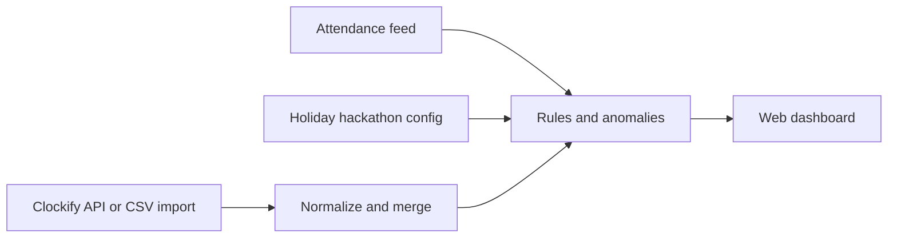

# System patterns

## High-level flow

## Patterns

- **Single normalized schema** for time entries whether sourced from Clockify API or CSV.
- **Idempotent ingestion**: dedupe by external id or stable hash (user, start, end, description).
- **Rules engine** pure/domain layer: given day + attendance code + total hours + entries → status + anomaly flags (test-first).
- **External boundaries**: Clockify HTTP and file import behind interfaces; tests use mocks/fixtures.
- **Human overrides** persisted with audit (who/when/reason).

## Anomalies (from policy doc)

Long days (12–14h+), overlapping intervals, repeated identical blocks, unapproved weekend work, project misallocation (prefer structured allowlists before LLM).
